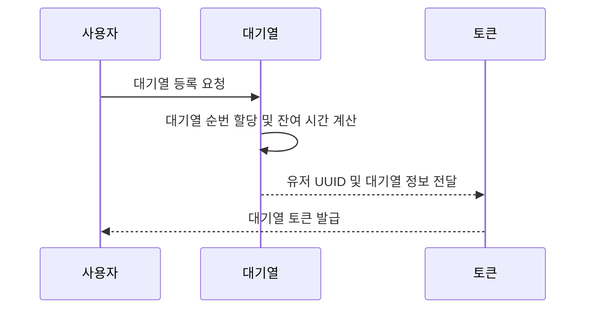
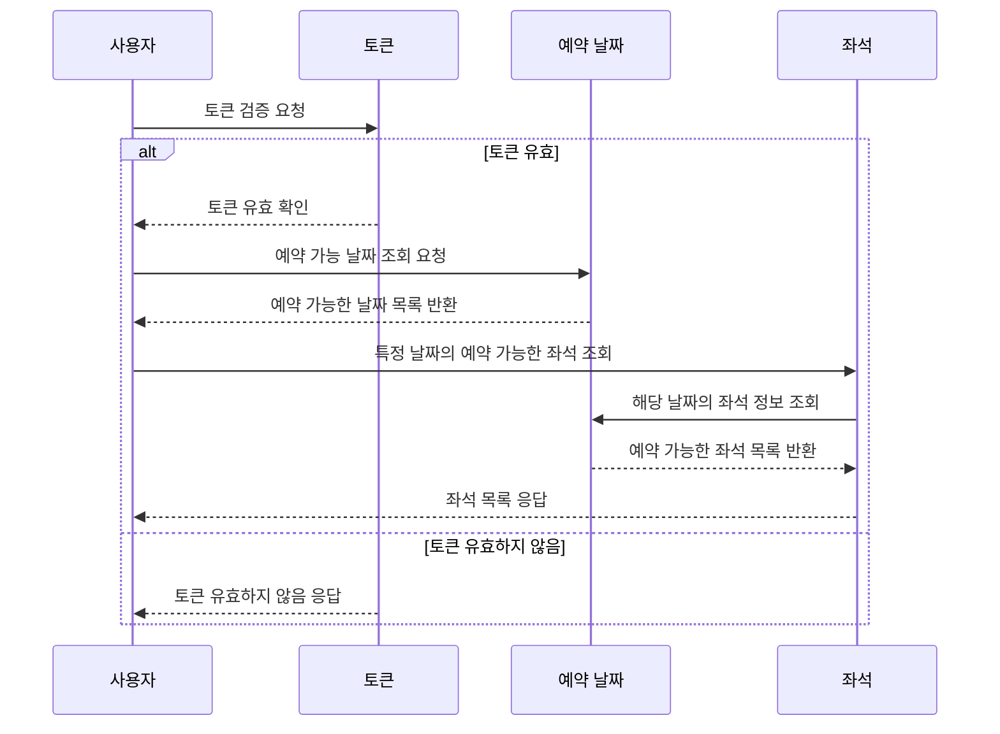
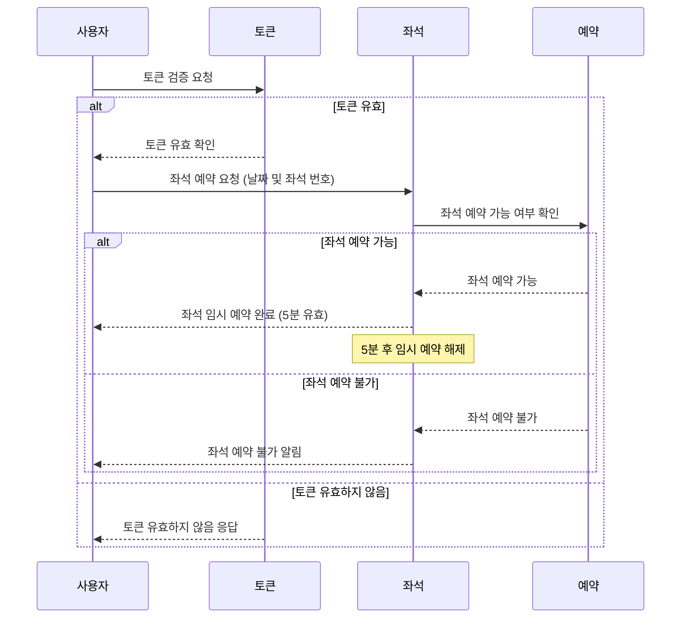
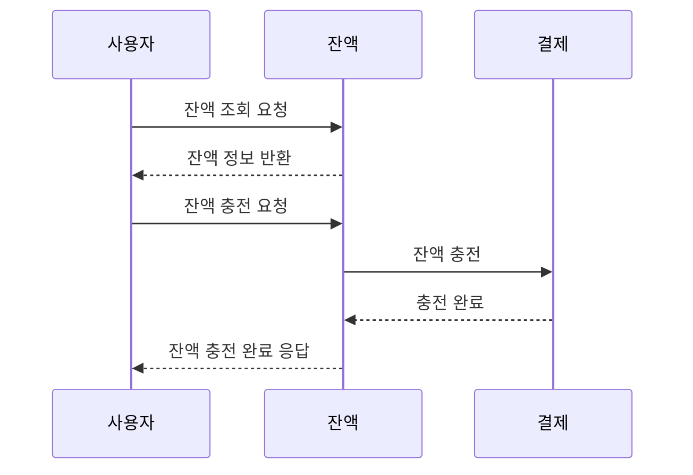
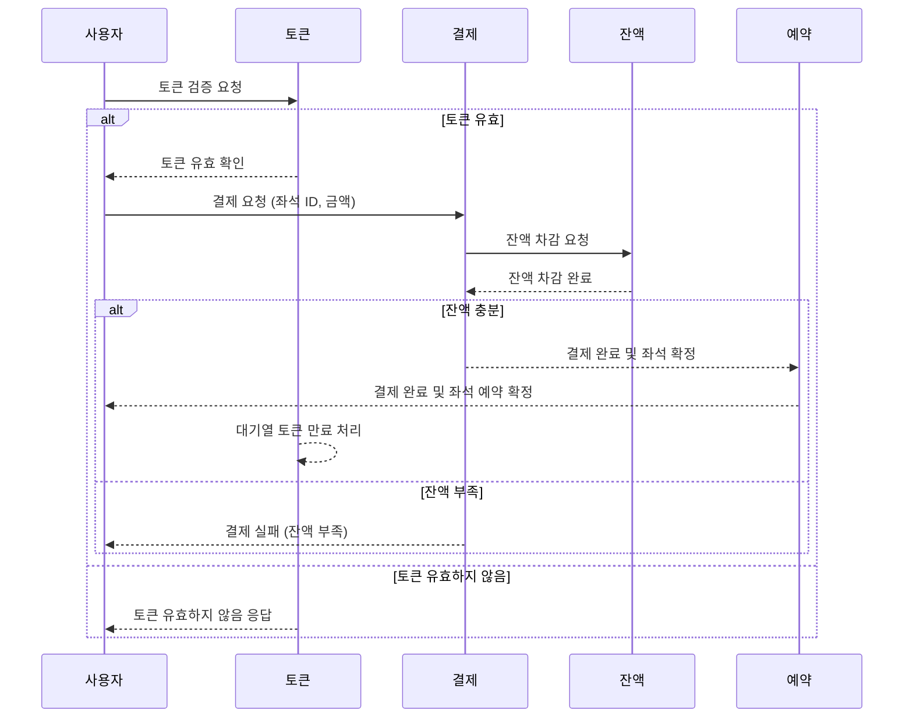
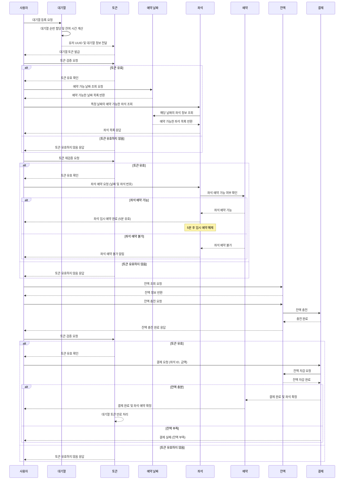

## [항해99 백엔드 플러스 6기] 콘서트 예약 서비스 

[e-커머스 서비스]

[맛집 검색 서비스]

✅ [콘서트 예약 서비스]

### **`STEP 05`**

- 시나리오 선정 및 프로젝트 Milestone 제출
- 시나리오 요구사항 별 분석 자료 제출

  > 시퀀스 다이어그램, 플로우 차트 등

- 자료들을 리드미에 작성 후 PR 링크 제출

### **`STEP 06`**

- ERD 설계 자료 제출
- API 명세 및 Mock API 작성
- 자료들을 리드미에 작성 후 PR링크 제출 ( 기본 패키지 구조, 서버 Configuration 등 )
---

### **`STEP 05`**

### **`[콘서트 예약 서비스]`** : [Milestone](https://github.com/Kook-s/hhplus-concert/milestones)

### **`시퀀스다이어그램`**

## 대기열 API

## 예약 가능 날짜 / 좌석 API 시퀀스 다이어그램

# 좌석 예약 요청 API 시퀀스 다이어그램

## 잔액 충전 / 조회 API 시퀀스 다이어그램

## 결제 API 시퀀스 다이어그램

## 콘서트 예약 서비스(전체)

